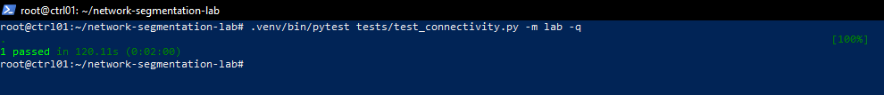
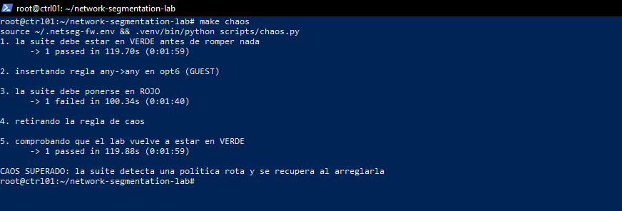
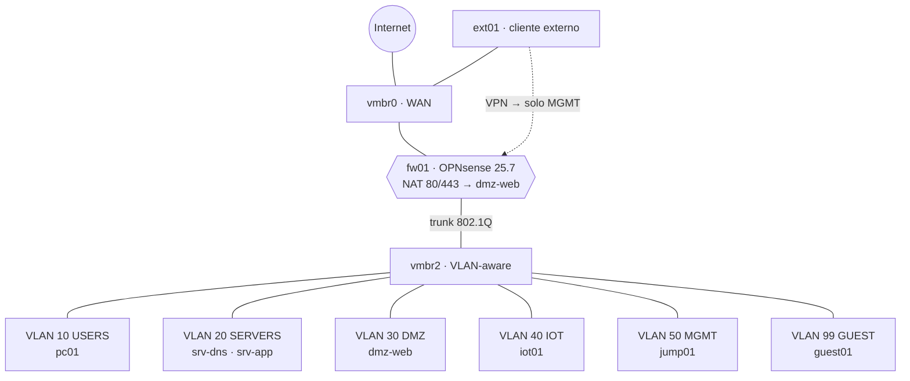
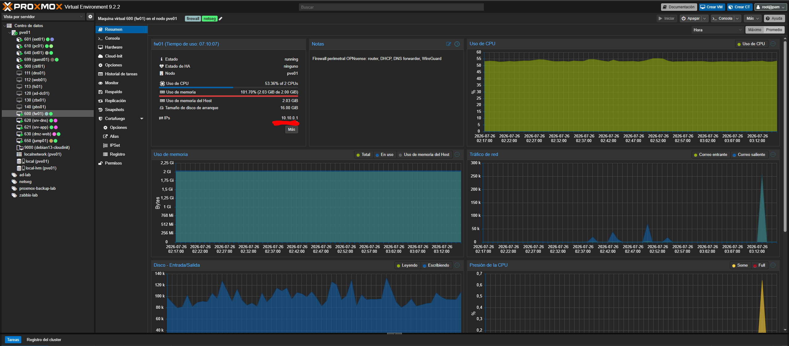
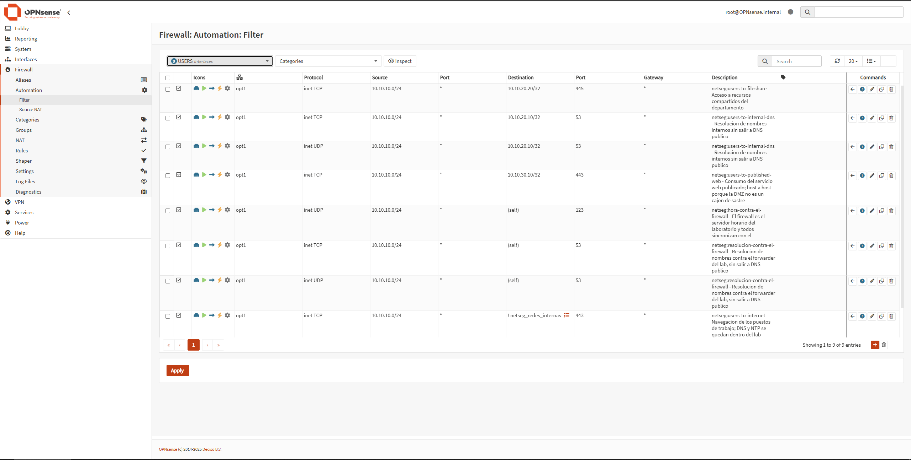
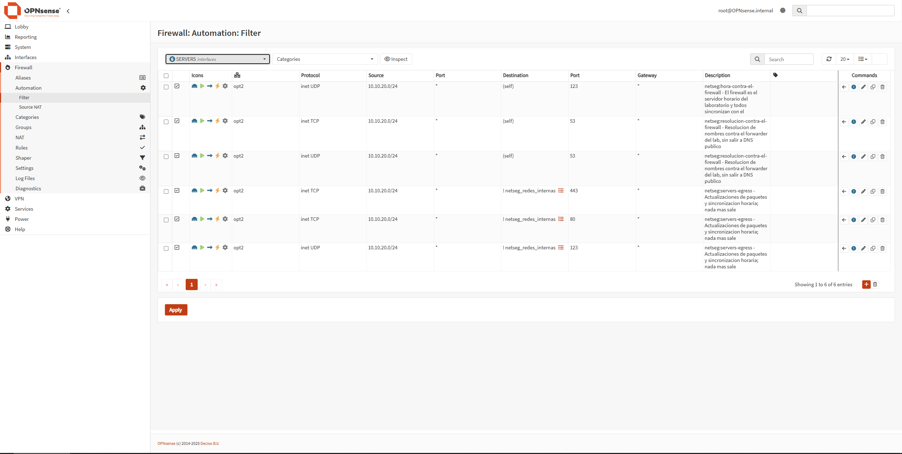
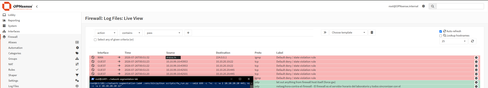
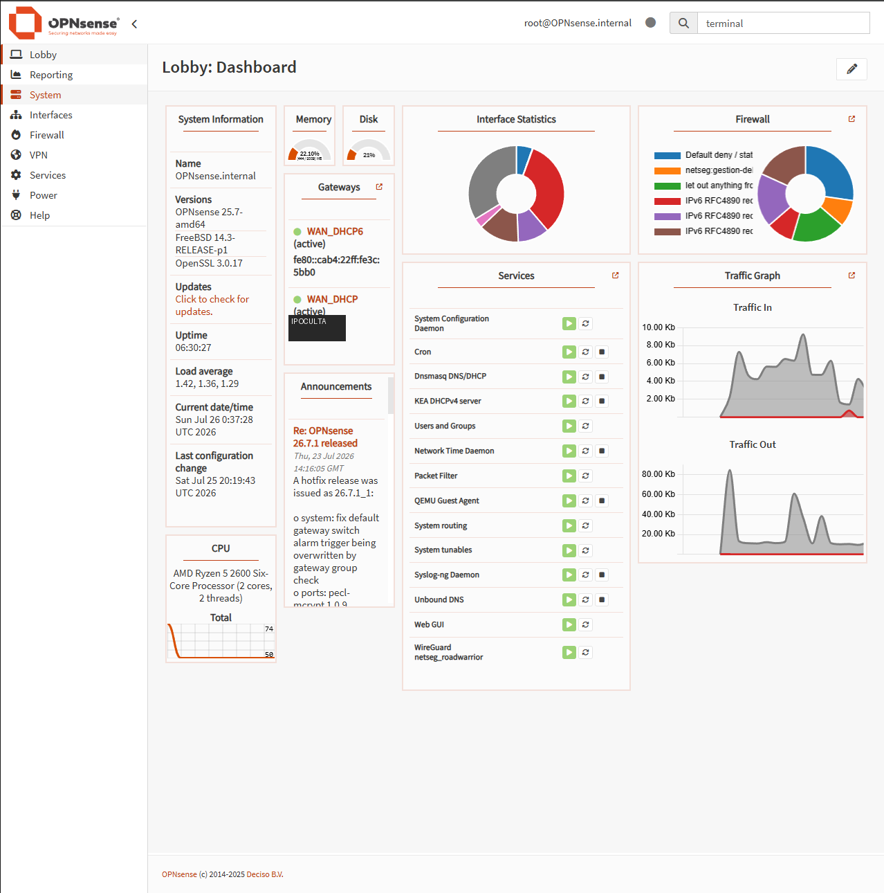
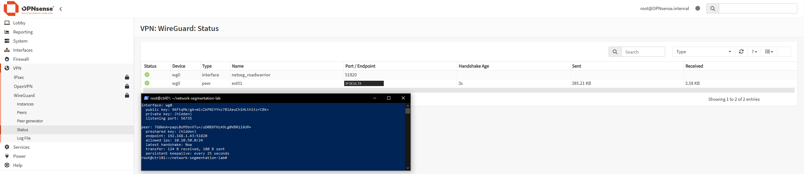
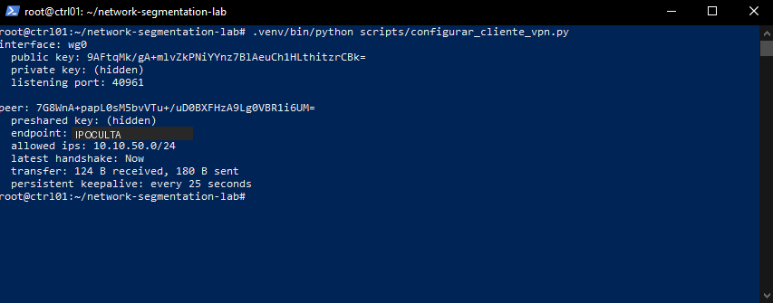

# network-segmentation-lab

En una red plana, un portátil comprometido en recepción tiene la misma ruta hacia la base
de datos que el administrador. Este laboratorio implementa segmentación con denegación por
defecto y verifica automáticamente que cada flujo permitido existe por una razón escrita.

Seis VLANs sobre Proxmox VE 9 con un OPNsense delante. Los flujos permitidos se declaran
en un solo fichero, `opnsense/flows.yml`, y de ahí salen dos cosas: las reglas del
firewall y la suite de tests que las comprueba. Las denegaciones no se escriben en ningún
sitio. Se calculan restando lo permitido a todas las combinaciones posibles.

## El resultado, en números

```
297 comprobaciones derivadas de 19 flujos declarados
  31 permisos   verificados: 31
 266 bloqueos   verificados: 266
```



Esos 266 bloqueos no los escribí yo. Salen del producto cartesiano de `flows.yml` (cada
origen contra cada host destino contra cada puerto de sondeo) menos lo permitido, así que
la matriz cubre todas las combinaciones. El fichero publicado,
[docs/matriz-flujos.md](docs/matriz-flujos.md), lo generan los tests al ejecutarse.

## Los tests también fallan cuando deben

`make chaos` mete una regla `any→any` en el segmento de invitados, lanza la suite,
comprueba que se pone en rojo, retira la regla y la vuelve a lanzar.



## Topología



Nueve invitados que levanta Terraform desde cero, en un Proxmox anidado con 11 GB:



## De flows.yml a las reglas

Cada regla del firewall sale de una entrada del fichero y hereda su descripción, que
explica el motivo del permiso. En la GUI no se toca nada: `make rules` sincroniza y
`make check` avisa si las reglas vivas se han separado del fichero.



En el segmento de servidores se ve un matiz que me costó una incidencia entera. La salida
a Internet no apunta a `any`, sino a `! netseg_redes_internas`, o sea a cualquier sitio
salvo el propio laboratorio.



Lo que no está permitido se deniega y queda registrado:



## Interfaces y servicios



DHCP por segmento con Kea, resolución interna obligatoria (Unbound reenviando y BIND
autoritativo de `lab.interno` en `srv-dns`), NAT de salida y la web de la DMZ publicada
hacia fuera por port forward.

## Acceso remoto que llega a MGMT y a nada más

WireGuard road-warrior, verificado desde fuera del perímetro. `ext01` levanta el túnel y
alcanza el bastión de administración; los demás segmentos siguen sin alcance, y eso
también lo comprueba un test.



En el cliente se ve por qué: el túnel solo enruta `10.10.50.0/24`.



## Provisionado con Ansible

Los servicios los instala Ansible con SELinux en enforcing. La segunda pasada termina con
`changed=0` en los cuatro servidores, así que el playbook es idempotente y relanzarlo no
cambia nada:


### Puesta en marcha

El repositorio no contiene ninguna dirección de la instalación concreta. El hipervisor se
referencia por su alias de SSH y las credenciales llegan por variables de entorno. Para
levantarlo en otra máquina hacen falta tres cosas, todas fuera del control de versiones:

| Dónde | Qué |
|---|---|
| `~/.ssh/config` del nodo de control | un `Host pve01` que apunte al hipervisor |
| `~/.netseg.env` | endpoint y token de la API de Proxmox |
| `~/.netseg-fw.env` | URL y clave de la API de OPNsense |

Los dos primeros los genera `scripts/bootstrap-pve.sh`, que además crea el pool, el rol de
privilegios mínimos, el contenedor de control y el wrapper de ejecución. A partir de ahí:

```bash
make up         # terraform apply del lab completo
make network    # VLANs, interfaces y DHCP en el firewall
make rules      # sincroniza las reglas del firewall con flows.yml
make nat        # publica la web de la DMZ hacia Internet
make vpn        # monta WireGuard y configura el cliente externo
make provision  # Ansible: servicios con SELinux enforcing
make check      # valida flows.yml y detecta deriva contra las reglas vivas
make test       # suite completa contra el lab
make report     # regenera docs/matriz-flujos.md
make chaos      # rompe la política a propósito: la suite debe ponerse en rojo
make destroy    # tira el lab (solo recursos del pool netseg)
```

## Fases

| # | Entregable | Criterio de aceptación, verificado |
|---|------------|------------------------------------|
| 1 | Terraform levanta 5 VMs, 4 LXC y los bridges VLAN | `make destroy && make up` desde cero deja los 9 invitados arrancados |
| 2 | OPNsense con interfaces, NAT y DHCP + harness | `pc01` obtiene IP por DHCP y sale a Internet; el wrapper ejecuta en las 9 máquinas |
| 3 | flows.yml → reglas del firewall, sin deriva | 53 reglas derivadas de 19 flujos; `make check` limpio e idempotente |
| 4 | Ansible con SELinux enforcing, idempotente | segunda pasada `changed=0`; ningún host en permissive |
| 5 | Suite completa y matriz generada | 297 de 297 comprobaciones, 266 bloqueos verificados |
| 6 | WireGuard: la VPN llega a MGMT y solo a MGMT | verificado desde `ext01`, fuera del perímetro |
| 7 | `make chaos`, documentación, ADRs | la suite se pone en rojo con una regla `any→any` y se recupera al quitarla |

## Cómo está montado

El hipervisor es un Proxmox VE 9 anidado en VMware Workstation, con 11 GB de RAM para
todo. El laboratorio vive en el pool `netseg` y se gestiona con un token de API cuyo rol
solo alcanza ese pool, porque en esa máquina hay otros proyectos. El nodo de control es un
contenedor LXC que queda fuera del pool, así que la automatización no puede tocar la
máquina desde la que se ejecuta
([ADR 0008](docs/adr/0008-nodo-de-control-lxc-vs-wsl2.md)).

Los tests se ejecutan fuera de banda. El runner no entra por SSH a la red que está
probando: habla con el hipervisor y usa `qm guest exec` o `pct exec` a través de un
wrapper que valida la VMID contra el pool antes de ejecutar nada. Si el runner entrase por
la red bajo prueba, un bloqueo correcto lo dejaría fuera
([ADR 0007](docs/adr/0007-clientes-lxc-y-ejecucion-fuera-de-banda.md)).

Hay dos capas de filtrado, OPNsense en el perímetro y firewalld en cada servidor. La
matriz verifica la política efectiva, es decir, lo que dejan pasar las dos capas juntas
([ADR 0006](docs/adr/0006-firewalld-y-politica-combinada.md)).

Las decisiones que la especificación no resolvía están razonadas en
[docs/arquitectura.md](docs/arquitectura.md#decisiones-tomadas-durante-la-implementación).

## Lo que no funcionó a la primera

En [docs/incidencias.md](docs/incidencias.md) hay 22 entradas con qué falló, cómo lo
diagnostiqué y cómo lo arreglé.

La número 19 la encontró la propia suite. Con los servicios ya provisionados, destapó que
los invitados alcanzaban la web de la DMZ. El fallo era una traducción mía: convertí
«salir a Internet» en destino `any`, y `any` incluye 10.10.0.0/16, así que permitir
navegar abría de paso el camino hacia los otros segmentos, una combinación que una lista
de `deny` escrita a mano nunca habría probado.

Otras que dieron guerra: el `reply-to` de pf dejando los handshakes TLS a medias, que
localicé con `tcpdump` viendo salir los paquetes con TTL 64 y no volver ninguno; el
confinamiento SELinux del agente QEMU, que denegaba la ejecución sin dejar un solo AVC en
el log; y el port forward de 443 hacia la DMZ, que se llevó por delante el acceso a la
GUI del propio firewall.

## Limitaciones

- No hay alta disponibilidad del firewall ni routing dinámico.
- No hay IDS ni SIEM. Eso es la fase 2 y un proyecto aparte, aunque el terreno queda
  preparado: Netflow saliendo hacia `jump01` y sitio reservado para `siem01` en MGMT.
- Las credenciales son de laboratorio y los certificados, autofirmados.
- La VPN se verifica desde un cliente fuera del perímetro, pero dentro de la red
  doméstica. No está probada desde una red externa real.
- Todo corre anidado, con 11 GB repartidos entre diez invitados, así que las cifras de
  rendimiento no son representativas.

En la documentación verás marcadores del tipo `<IP-DEL-HIPERVISOR>`. El direccionamiento
del laboratorio (10.10.x.x) sí está publicado porque forma parte del diseño; el de la red
donde lo monté, no.

## Licencia

MIT. Si lo levantas y encuentras un hueco en la matriz, me interesa saberlo.
