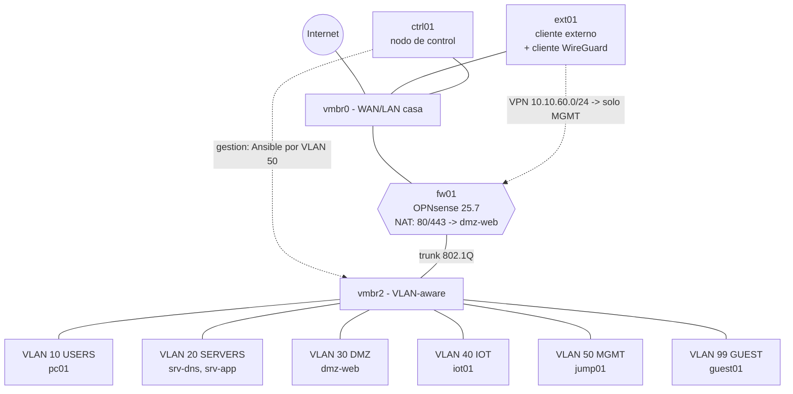

# Arquitectura del laboratorio

El diseño de referencia está en [spec.md](spec.md) (§4). Este documento recoge lo que ya
está montado y las desviaciones respecto al spec, con su porqué.

## Topología

## Desviación del spec: `vmbr2` en lugar de `vmbr1`

El spec asume que `vmbr1` está libre. En este pve01, `vmbr1` ya existía (IP de host
`10.10.10.1/24`, NAT de salida y 4 VMs de otro laboratorio conectadas) y ese
direccionamiento colisiona con la VLAN 10 del lab. Como los recursos de otros proyectos
no se tocan, el bridge interno del lab es `vmbr2` (VLAN-aware, sin puerto físico),
parametrizado en Terraform como `lab_bridge`. Detalle en [incidencias.md](incidencias.md#1).

## fw01: orden de NICs y WAN desconectada

La config de fábrica del ISO de OPNsense asigna LAN (<PUERTA-DE-ENLACE-DOMESTICA>/24 + DHCP) a la
primera NIC. Para que ese default nunca pueda tocar la red doméstica (incidencia #7),
`net0` (vtnet0) es el trunk en vmbr2 (aislado) y `net1` (vtnet1) es la WAN en vmbr0, pero
desconectada (`link_down`) hasta completar la instalación manual y la asignación de
interfaces. El runbook documenta la reconexión.

## Plan de direccionamiento

| VLAN | Nombre  | Red             | Gateway (fw01) | DHCP        |
|------|---------|-----------------|----------------|-------------|
| 10   | USERS   | 10.10.10.0/24   | 10.10.10.1     | .100–.200   |
| 20   | SERVERS | 10.10.20.0/24   | 10.10.20.1     | estático    |
| 30   | DMZ     | 10.10.30.0/24   | 10.10.30.1     | estático    |
| 40   | IOT     | 10.10.40.0/24   | 10.10.40.1     | .50–.150    |
| 50   | MGMT    | 10.10.50.0/24   | 10.10.50.1     | estático    |
| 99   | GUEST   | 10.10.99.0/24   | 10.10.99.1     | .10–.250    |
| —    | VPN     | 10.10.60.0/24   | —              | WireGuard   |

## Máquinas y VMIDs

Los VMIDs no están en el spec; se fijan aquí para que wrapper, Terraform y tests
hablen el mismo idioma. Todos dentro del pool `netseg` salvo ctrl01.

| VMID | Host      | Tipo | VLAN | IP           | SO           | RAM                  |
|------|-----------|------|------|--------------|--------------|----------------------|
| 600  | `fw01`    | VM   | —    | trunk        | OPNsense 25.7| 2048 fija (sin balloon) |
| 601  | `ext01`   | LXC  | —    | vmbr0 DHCP   | Alpine       | 256                  |
| 610  | `pc01`    | LXC  | 10   | DHCP         | AlmaLinux 9  | 256                  |
| 620  | `srv-dns` | VM   | 20   | 10.10.20.10  | AlmaLinux 9  | 1024 / balloon 512   |
| 621  | `srv-app` | VM   | 20   | 10.10.20.20  | AlmaLinux 9  | 1024 / balloon 512   |
| 630  | `dmz-web` | VM   | 30   | 10.10.30.10  | AlmaLinux 9  | 1024 / balloon 512   |
| 640  | `iot01`   | LXC  | 40   | DHCP         | Alpine       | 256                  |
| 650  | `jump01`  | VM   | 50   | 10.10.50.10  | AlmaLinux 9  | 1024 / balloon 512   |
| 699  | `guest01` | LXC  | 99   | DHCP         | Alpine       | 256                  |
| 900  | `ctrl01`  | LXC  | —    | vmbr0 DHCP   | Ubuntu 24.04 | 2048 (fuera del pool)|

Ballooning según spec §4: mínimo 512 / máximo 1024 en las cuatro AlmaLinux (la columna
RAM por host del spec se interpreta como techo nominal); desactivado en fw01 (FreeBSD).

## Decisiones tomadas durante la implementación

El spec no las resuelve; se documentan aquí para que se puedan discutir.

| Decisión | Por qué |
|---|---|
| El resolver del lab es Unbound, como pide §7, aunque 25.7 trae dnsmasq activo | dnsmasq no servía DHCP (sin rangos), así que no había conflicto: bastó dejar Unbound escuchando y declarar el flujo hacia el firewall |
| La GUI del firewall vive en el 8443 | publicar 443 hacia la DMZ se comía el puerto de administración; separar gestión y servicio es lo habitual en producción |
| `ctrl01` tiene una segunda interfaz en MGMT (10.10.50.5) | Ansible necesita camino hacia los servidores, y la matriz ya permite MGMT→SERVERS/DMZ por SSH: provisionar no abre ningún agujero nuevo. Los tests siguen siendo fuera de banda |
| La LAN sin etiquetar es 10.10.0.1/24 | es la vía de gestión del firewall y no debe chocar ni con la red doméstica ni con ninguna VLAN del plan |
| «Salir a Internet» se traduce como destino negado sobre un alias de redes internas | un destino `any` incluye el propio laboratorio (ver incidencia #19) |
| Los rangos DHCP viven en `setup_red.py`, no en `flows.yml` | `flows.yml` es la fuente de verdad de la matriz de flujos, no del direccionamiento |
| Palabras reservadas `WAN` y `FIREWALL` en `flows.yml` | los servicios del propio cortafuegos (DNS, hora, gestión, túnel) son flujos reales y se declaran como cualquier otro |

## Recursos preexistentes en pve01 (intocables)

VMs 111 (dns01), 112 (web01), 113 (fs01), 9000 (debian13-cloudinit) en vmbr1, y los
pools/VMs de los proyectos `ad-lab` (120), `zabbix-lab` (130) y `proxmox-backup-lab`
(140). Ninguna automatización de este repo los referencia; el wrapper los rechaza por
no pertenecer al pool `netseg` (verificado con la VMID 111 en el bootstrap).
